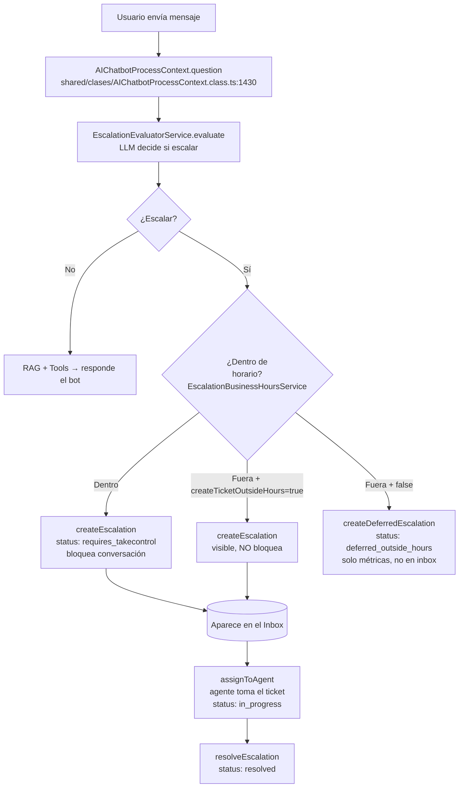
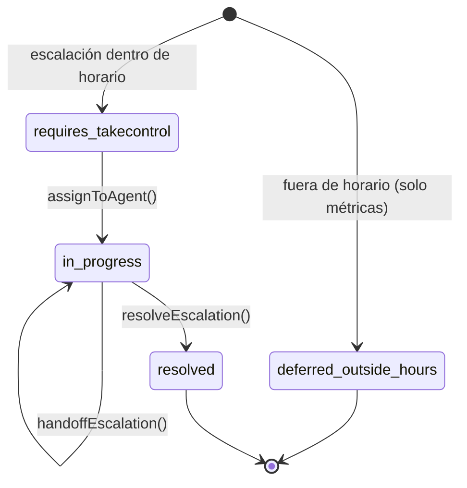

> Nota de proyecto. Fuente en repo: `docs/escalacion-forzada-admin-analisis-y-plan.md`.
> Relacionado: [[Claude Sessions/Active Context]] · sesión [[Claude Sessions/silia/escalacion-forzada-admin/2026-08-06]]

# Escalación forzada por admin — Análisis del sistema actual + Plan de implementación

> **Objetivo de negocio:** que **cualquier persona con acceso al inbox** pueda hacer una
> **escalación forzada** en cualquier momento y horario, que convierta la conversación en
> ticket y **tome control** (el bot deja de responder). El ticket entra al inbox **SIN
> asignar**; luego se **asigna manualmente** desde la sección de tickets del front (con el
> flujo de asignación que ya existe). Además, dos columnas nuevas para auditar *que* fue
> forzada y *por quién*.
>
> **Cambios de alcance (revisados):** ~~solo admin~~ → **permiso para todos**;
> ~~auto-asignada al que la hizo~~ → **asignación manual posterior** desde tickets.

---

## 1. Resumen ejecutivo

- En Silia **escalación == ticket**: un `EscalationRecord` (DynamoDB `Escalations`) *es*
  el ticket. No hay entidad "Ticket" separada.
- Hoy **solo se escala de forma automática** (el LLM decide durante el mensaje). **No
  existe** ninguna forma de que un humano cree una escalación a demanda → ese es el gap.
- El **gate de horario** vive **solo** en el evaluador del LLM
  (`EscalationEvaluatorService`), **no** en la creación del registro. Por lo tanto, un
  flujo que llame directo a `createEscalation()` **ya ignora el horario**.
- La feature = **una llamada directa a `createEscalation()`** (que ya existe) detrás de
  un endpoint nuevo con permiso amplio, marcando el registro como forzado. La
  **asignación NO es parte de este flujo** — se hace después, manual, con el endpoint
  `assign` que ya existe. + 2 columnas de auditoría en el modelo.

---

## 2. Cómo funciona hoy (flujo automático)



**Puntos clave del flujo actual:**

| Fase | Archivo | Qué hace |
|---|---|---|
| Evaluación LLM | `shared/clases/AIChatbotProcessContext.class.ts:1430` | Decide si el mensaje escala |
| Gate de horario | `Assistant/domain/services/EscalationBusinessHoursService.ts:40` (`isWithinBusinessHours`) | **Único lugar** donde se valida horario |
| Integración horario | `Assistant/domain/services/EscalationEvaluatorService.ts:109-146` | Fuera de horario → bandera especial |
| Crear ticket | `Assistant/domain/services/EscalationRecordService.ts:33` (`createEscalation`) | Crea record `requires_takecontrol`, marca la conversación, emite `escalation.created`. **No valida horario.** |
| Asignar | `EscalationRecordService.ts:192` (`assignToAgent`) | Exige `requires_takecontrol` → `in_progress`, setea `assignedTo`, emite `escalation.assigned` |

---

## 3. Modelo de datos

**Tabla:** DynamoDB `Escalations` · **PK:** `escalationRecordId` · **SK:** `triggeredAt`
**Modelo:** `Assistant/domain/models/EscalationRecord.model.ts`
**Interface:** `Assistant/domain/interfaces/IEscalationRecord.interface.ts`

### Estados



### Campos relevantes (hoy)
`escalationRecordId, conversationId, channelId, chatbotId, escalationConfigId, teams?,
triggeredAt, triggerMessage, category, reason, confidence, status, statusCategoryKey,
assignedTo?, assignedToName?, assignedAt?, handoffHistory[], resolvedBy?, resolvedByName?,
timeToFirstResponse?, timeToResolution?, createdAt, updatedAt`

---

## 4. Endpoints y permisos actuales

| Método | Ruta | Handler | Permiso |
|---|---|---|---|
| POST | `/{chatbotId}/escalations/assign` | `Escalations/Lifecycle/Assign/index.ts` | `agent.inbox.reassign` |
| PUT | `/{chatbotId}/escalations/handoff` | `Lifecycle/Handoff/index.ts` | `agent.inbox.reassign` |
| PUT | `/{chatbotId}/escalations/resolve` | `Lifecycle/Resolve/index.ts` | `agent.inbox.reassign` |
| GET | `/{chatbotId}/escalations/inbox` | `Lifecycle/Inbox/index.ts` | `agent.inbox.view` |

**WebSocket:** `escalation.created`, `escalation.assigned`, `escalation.handoff`, `escalation.resolved`.

---

## 5. El gap

- No hay endpoint ni servicio para **crear una escalación a demanda** (todo pasa por el LLM).
- No hay forma de **saltar el horario** deliberadamente (aunque `createEscalation` no lo valida, nadie lo llama directo fuera del LLM).
- No se registra **si** una escalación fue forzada ni **quién** la forzó.

---

## 6. Plan de implementación

### 6.1 Decisiones tomadas

| Tema | Decisión |
|---|---|
| Permiso | **Para todos** los que tienen acceso al inbox → gate con `agent.inbox.view` (permiso amplio que ya tienen todos los roles del inbox). Sin restricción de admin. |
| Asignación | **NO se auto-asigna.** El ticket entra `requires_takecontrol` **sin asignar**; la persona lo toma **manual** desde tickets con el endpoint `assign` existente. |
| Conversación | **Bloquear / tomar control** (`blockConversation: true`) → el bot deja de responder mientras el ticket espera ser tomado |
| Duplicados | Si ya hay escalación activa → **rechazar 409**; el FE además **oculta el botón** |
| Identidad (auditoría) | **Del token** (`forcedBy` = userId; `forcedByName` = nombre del que forzó). No se usa para asignar, solo para auditar. |
| Auditoría | **+2 columnas**: `isForced` y `forcedBy`/`forcedByName` |

### 6.2 Flujo nuevo (escalación forzada)

```mermaid
flowchart TD
    A[Cualquiera pulsa 'Escalar' en el inbox] --> R[POST /{chatbotId}/escalations/force<br/>Force/index.ts]
    R --> PERM{Permiso<br/>agent.inbox.view?}
    PERM -->|No| F403[403]
    PERM -->|Sí| DUP{¿Conversación ya<br/>tiene escalación activa?}
    DUP -->|Sí| F409[409 ya existe escalación activa]
    DUP -->|No| C[createEscalation<br/>isForced: true<br/>forcedBy/forcedByName: del token<br/>blockConversation: true<br/>category: 'Forzada'<br/>status: requires_takecontrol]
    C --> WS[WS: escalation.created]
    WS --> OK[200 → ticket forzado SIN asignar, bot silenciado]
    OK -.-> M[Después: alguien lo toma manual<br/>POST /escalations/assign existente<br/>status: in_progress]
```

### 6.3 Cambios por archivo

**A) Modelo — 2 columnas de auditoría (inmutables)**
- `Assistant/domain/interfaces/IEscalationRecord.interface.ts` — agregar:
  ```ts
  /** True si fue una escalación forzada por un admin (no automática del LLM). */
  isForced?: boolean;
  /** userId del admin que la forzó (inmutable, sobrevive handoffs). */
  forcedBy?: string;
  /** Nombre del admin que la forzó, para mostrar. */
  forcedByName?: string;
  ```
- `Assistant/domain/models/EscalationRecord.model.ts` — en el constructor:
  ```ts
  this.isForced     = escalation.isForced ?? false;   // auto = false → retrocompatible
  this.forcedBy     = escalation.forcedBy;
  this.forcedByName = escalation.forcedByName;
  ```
  …y agregarlos al `toJSON()`/salida.
- `ICreateEscalationInput` — campos opcionales `isForced`, `forcedBy`, `forcedByName`.

> **Retrocompatibilidad:** los registros automáticos y los viejos (sin el campo) se leen
> como `isForced: false`. Los dos campos **no cambian** en handoff ni al resolver.

**B) Servicio — método de creación forzada (sin asignar)**
- `Assistant/domain/services/EscalationRecordService.ts` — nuevo `forceEscalate(input)`:
  1. Cargar la conversación; si `hasActiveEscalation` → lanzar error tipado (→ 409).
  2. `createEscalation({ ...datos, isForced: true, forcedBy, forcedByName,
     blockConversation: true, category: 'Forzada', escalationConfigId: 'manual',
     reason, triggerMessage })`.
  3. Devolver el record creado (`requires_takecontrol`, forzado, **sin asignar**).
- **No** llama a `assignToAgent`. La asignación se hace después, manual, con el endpoint
  `POST /{chatbotId}/escalations/assign` que **ya existe** (desde la sección de tickets).

**C) Handler nuevo**
- `Assistant/application/Escalations/Lifecycle/Force/index.ts` (mirror de `Assign/index.ts`):
  - `assertPermission(event, 'agent.inbox.view')` — permiso amplio (todos los del inbox).
  - `userId`/`userName` desde el contexto del token → solo para `forcedBy`/`forcedByName`.
  - Body: `{ conversationId, channelId?, reason? }` (chatbotId del path).
  - Validar que la conversación pertenece al `chatbotId`/cuenta.
  - Llamar `forceEscalate`; mapear el error de duplicado a **409**.

**D) Permiso CASL**
- **No se crea permiso nuevo.** Se reutiliza `agent.inbox.view` (lo tienen todos los roles
  con acceso al inbox), de modo que la escalación forzada esté disponible **para todos**.
  Si más adelante se quiere granular, se puede introducir un permiso dedicado otorgado a
  todos los roles.

**E) Infra**
- `Assistant/infrastructure/aws.template.yml` — recurso Lambda + ruta `POST
  /{chatbotId}/escalations/force` (mirror del de assign) **+ su build entry**
  (el build es por-handler; sin la entrada no se empaqueta).

**F) Tests**
- Servicio: fuerza OK → record `requires_takecontrol` **sin asignar**, `isForced: true`,
  `forcedBy` seteado; rechaza si ya hay escalación activa.
- Handler: 200 happy path; 403 sin permiso `agent.inbox.view`; 409 con escalación activa;
  `forcedBy`/`forcedByName` tomados del token.

### 6.4 Ítem abierto a confirmar
- **`userName` para `forcedByName`:** confirmar si viene en los claims del JWT o si hay
  que resolverlo con un lookup de `User` por `userId`. Ya **no es bloqueante** (es solo el
  nombre para mostrar en la columna de auditoría; `forcedBy`=userId sí sale seguro del token).

### 6.5 Fuera de alcance (Frontend / otro repo)
- Botón "Escalar" (forzar) en el inbox, oculto cuando la conversación ya tiene escalación activa.
- **Asignación manual** del ticket forzado desde la sección de tickets (usa el endpoint
  `assign` existente) — este es el paso que reemplaza la auto-asignación.
- Mostrar badge "Forzada" y columna "Forzada por {nombre}" usando `isForced`/`forcedByName`.

---

## 7. Archivos clave (referencia)

- `shared/clases/AIChatbotProcessContext.class.ts` — orquestación del mensaje/escalación (1430+)
- `Assistant/domain/services/EscalationRecordService.ts` — create/assign/handoff/resolve
- `Assistant/domain/services/EscalationEvaluatorService.ts` — evaluación LLM + gate horario
- `Assistant/domain/services/EscalationBusinessHoursService.ts` — `isWithinBusinessHours`
- `Assistant/domain/models/EscalationRecord.model.ts` — modelo del ticket
- `Assistant/domain/interfaces/IEscalationRecord.interface.ts` — interface/estados
- `Assistant/application/Escalations/Lifecycle/Assign/index.ts` — patrón del handler
- `shared/middleware/requirePermission.ts` — validación de permisos
- `docs/adrs/escalations_in_silia.md` — ADR con más contexto