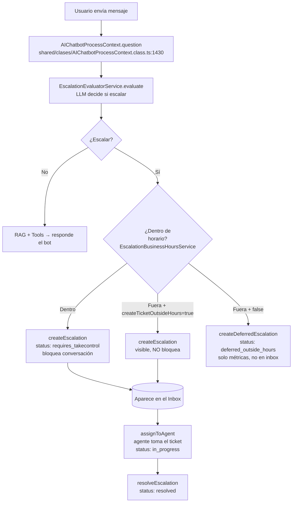
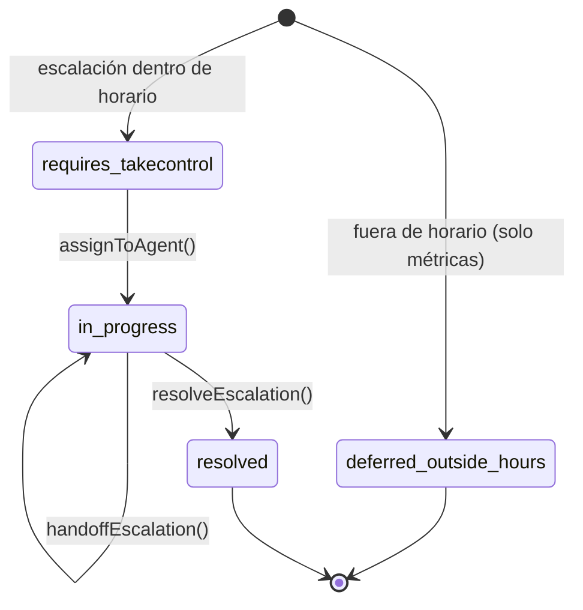

> Nota de proyecto. Fuente en repo: `docs/escalacion-forzada-admin-analisis-y-plan.md`.
> Guía FE: `docs/escalacion-forzada-frontend-integration.md`.
> Relacionado: [[Claude Sessions/Active Context]] · sesión [[Claude Sessions/silia/escalacion-forzada-admin/2026-08-06]]

# Manual escalation (escalación manual + tomar control) — Análisis + Plan

> **Objetivo de negocio (ticket Feature 1, SL-1579):** que **cualquier operador del inbox**
> pueda escalar manualmente una conversación a **Tickets** y **tomar el control** en el
> momento, a cualquier hora: crea el ticket (si no existe), lo **asigna al operador que
> ejecuta la acción** (`in_progress`), el bot deja de responder y la vista salta a Tickets.
> Es **idempotente**: si la conversación ya tenía ticket, no crea otro — el operador toma el
> control del existente. Además, dos columnas nuevas para auditar *que* fue manual y *por quién*.
>
> **Historial de alcance:** ~~solo admin~~ → **permiso nuevo para todos los roles del inbox**;
> ~~sin asignar / asignación manual posterior~~ → **auto-asigna al operador (toma control)**;
> ~~409 si ya hay ticket~~ → **idempotente: toma control del existente**.

---

## 1. Resumen ejecutivo

- En Silia **escalación == ticket**: un `EscalationRecord` (DynamoDB `Escalations`) *es*
  el ticket. No hay entidad "Ticket" separada.
- Hoy **solo se escala de forma automática** (el LLM decide durante el mensaje). **No
  existe** ninguna forma de que un humano cree una escalación a demanda → ese es el gap.
- El **gate de horario** vive **solo** en el evaluador del LLM
  (`EscalationEvaluatorService`), **no** en la creación del registro. Por lo tanto, un
  flujo que llame directo a `createEscalation()` **ya ignora el horario**.
- La feature = componer piezas que **ya existen** detrás de un endpoint nuevo con permiso
  propio: `createEscalation()` (forzada, bloquea) **+ `assignToAgent()`** para tomar el
  control; y si ya hay ticket, `assignToAgent`/`handoffEscalation` sobre el existente
  (idempotente). + 2 columnas de auditoría en el modelo.

---

## 2. Cómo funciona hoy (flujo automático)



**Puntos clave del flujo actual:**

| Fase | Archivo | Qué hace |
|---|---|---|
| Evaluación LLM | `shared/clases/AIChatbotProcessContext.class.ts:1430` | Decide si el mensaje escala |
| Gate de horario | `Assistant/domain/services/EscalationBusinessHoursService.ts:40` (`isWithinBusinessHours`) | **Único lugar** donde se valida horario |
| Integración horario | `Assistant/domain/services/EscalationEvaluatorService.ts:109-146` | Fuera de horario → bandera especial |
| Crear ticket | `Assistant/domain/services/EscalationRecordService.ts:33` (`createEscalation`) | Crea record `requires_takecontrol`, marca la conversación, emite `escalation.created`. **No valida horario.** |
| Asignar | `EscalationRecordService.ts:192` (`assignToAgent`) | Exige `requires_takecontrol` → `in_progress`, setea `assignedTo`, emite `escalation.assigned` |

---

## 3. Modelo de datos

**Tabla:** DynamoDB `Escalations` · **PK:** `escalationRecordId` · **SK:** `triggeredAt`
**Modelo:** `Assistant/domain/models/EscalationRecord.model.ts`
**Interface:** `Assistant/domain/interfaces/IEscalationRecord.interface.ts`

### Estados



### Campos relevantes (hoy)
`escalationRecordId, conversationId, channelId, chatbotId, escalationConfigId, teams?,
triggeredAt, triggerMessage, category, reason, confidence, status, statusCategoryKey,
assignedTo?, assignedToName?, assignedAt?, handoffHistory[], resolvedBy?, resolvedByName?,
timeToFirstResponse?, timeToResolution?, createdAt, updatedAt`

---

## 4. Endpoints y permisos actuales

| Método | Ruta | Handler | Permiso |
|---|---|---|---|
| POST | `/{chatbotId}/escalations/assign` | `Escalations/Lifecycle/Assign/index.ts` | `agent.inbox.reassign` |
| PUT | `/{chatbotId}/escalations/handoff` | `Lifecycle/Handoff/index.ts` | `agent.inbox.reassign` |
| PUT | `/{chatbotId}/escalations/resolve` | `Lifecycle/Resolve/index.ts` | `agent.inbox.reassign` |
| GET | `/{chatbotId}/escalations/inbox` | `Lifecycle/Inbox/index.ts` | `agent.inbox.view` |

**WebSocket:** `escalation.created`, `escalation.assigned`, `escalation.handoff`, `escalation.resolved`.

---

## 5. El gap

- No hay endpoint ni servicio para **crear una escalación a demanda** (todo pasa por el LLM).
- No hay forma de **saltar el horario** deliberadamente (aunque `createEscalation` no lo valida, nadie lo llama directo fuera del LLM).
- No se registra **si** una escalación fue forzada ni **quién** la forzó.

---

## 6. Plan de implementación

### 6.1 Decisiones tomadas

| Tema | Decisión |
|---|---|
| Permiso | **Permiso nuevo `agent.inbox.force_escalate`**, otorgado a **todos** los roles del inbox (superadmin, superuser, implementador, admin, supervisor, operator) en el seed. Sin restricción de admin. |
| Asignación | **SÍ se auto-asigna** al operador que escala (toma control) → `in_progress`, `assignedTo` = operador. *(Actualizado por el ticket Feature 1; revierte la versión previa "sin asignar".)* |
| Conversación | **Bloquear / tomar control** (`blockConversation: true`) → el bot deja de responder |
| Duplicados / ya tiene ticket | **Idempotente — tomar control**, no 409: si ya hay escalación activa, no crea otra; reasigna la existente al operador (aunque esté `in_progress` con otro; doble clic del mismo = no-op). |
| Identidad (auditoría) | **Del token** (`forcedBy` = userId; `forcedByName` = nombre del que forzó). No se usa para asignar, solo para auditar. |
| Auditoría | **+2 columnas**: `isForced` y `forcedBy`/`forcedByName` |

### 6.2 Flujo nuevo (escalación forzada)

```mermaid
flowchart TD
    A[Operador pulsa 'Manual escalation'] --> R[POST /{chatbotId}/escalations/force<br/>Force/index.ts]
    R --> PERM{Permiso<br/>agent.inbox.force_escalate?}
    PERM -->|No| F403[403]
    PERM -->|Sí| DUP{¿Conversación ya<br/>tiene escalación activa?}
    DUP -->|No| C[createEscalation<br/>isForced: true, forcedBy: del token<br/>blockConversation: true, category: 'Forzada']
    C --> AS[assignToAgent<br/>operador del token<br/>status: in_progress]
    DUP -->|Sí, sin asignar| AS2[assignToAgent existente<br/>toma control]
    DUP -->|Sí, de otro operador| HO[handoffEscalation<br/>toma control auditado]
    DUP -->|Sí, del mismo operador| NOOP[no-op idempotente]
    AS --> OK[200 → ticket in_progress, asignado al operador, bot silenciado]
    AS2 --> OK
    HO --> OK
    NOOP --> OK
```

### 6.3 Cambios por archivo

**A) Modelo — 2 columnas de auditoría (inmutables)**
- `Assistant/domain/interfaces/IEscalationRecord.interface.ts` — agregar:
  ```ts
  /** True si fue una escalación forzada por un admin (no automática del LLM). */
  isForced?: boolean;
  /** userId del admin que la forzó (inmutable, sobrevive handoffs). */
  forcedBy?: string;
  /** Nombre del admin que la forzó, para mostrar. */
  forcedByName?: string;
  ```
- `Assistant/domain/models/EscalationRecord.model.ts` — en el constructor:
  ```ts
  this.isForced     = escalation.isForced ?? false;   // auto = false → retrocompatible
  this.forcedBy     = escalation.forcedBy;
  this.forcedByName = escalation.forcedByName;
  ```
  …y agregarlos al `toJSON()`/salida.
- `ICreateEscalationInput` — campos opcionales `isForced`, `forcedBy`, `forcedByName`.

> **Retrocompatibilidad:** los registros automáticos y los viejos (sin el campo) se leen
> como `isForced: false`. Los dos campos **no cambian** en handoff ni al resolver.

**B) Servicio — escalación manual + tomar control (idempotente)**
- `Assistant/domain/services/EscalationRecordService.ts` — nuevo `forceEscalate(input)`:
  1. Cargar la conversación.
  2. **Si YA tiene escalación activa** (`hasActiveEscalation` + `activeEscalationId`):
     buscar el registro con `EscalationRecordModel.findByConversation` y **tomar control**:
     - `requires_takecontrol` → `assignToAgent(operador)`.
     - `in_progress` con **otro** operador → `handoffEscalation(from→operador)`.
     - `in_progress` con el **mismo** operador → no-op (devuelve el existente).
     - (No crea otro ticket.)
  3. **Si NO tiene escalación activa:** `createEscalation({ ...datos, isForced: true,
     forcedBy, forcedByName, blockConversation: true, category: 'Forzada',
     escalationConfigId: 'manual', reason, triggerMessage })` **y luego**
     `assignToAgent(operador)` → `in_progress` (toma control).
  4. Devolver el ticket resultante (`in_progress`, `assignedTo` = operador).
- Reusa `assignToAgent` y `handoffEscalation` existentes (sin lógica de takeover duplicada).

**C) Handler nuevo**
- `Assistant/application/Escalations/Lifecycle/Force/index.ts` (mirror de `Assign/index.ts`):
  - `assertPermission(event, 'agent.inbox.force_escalate')` — permiso nuevo (todos los del inbox).
  - `forcedBy` = `userId` del token (autoritativo); `forcedByName` = `body.forcedByName ?? email` del token.
  - Body: `{ conversationId, channelId, reason?, forcedByName? }` (chatbotId del path).
  - Validar que la escalación pertenece al `chatbotId`.
  - Devolver `{ status, assignedTo, ... }`. **Sin 409** (idempotente); errores: 400/401/403/500.

**D) Permiso CASL (permiso NUEVO)**
- **`agent.inbox.force_escalate`** agregado al catálogo backend
  (`scripts/migrations/permissions-catalog.json`, `_meta.total` 102→103) y a la matriz
  rol→permiso (`scripts/migrations/role-permissions.json`) otorgado a **todos** los roles
  del inbox. También registrado en el catálogo FE (`app/src/features/auth/permissions/catalog.ts`).
- ⚠️ **Orden de deploy:** el permiso debe **sembrarse en la BD** (correr el seed de permisos)
  ANTES de que el endpoint sea usable; hasta entonces `assertPermission` lo niega para
  todos (salvo superuser god-mode). Igual que cualquier permiso nuevo del catálogo.

**E) Infra**
- `Assistant/infrastructure/aws.template.yml` — recurso Lambda + ruta `POST
  /{chatbotId}/escalations/force` (mirror del de assign) **+ su build entry**
  (el build es por-handler; sin la entrada no se empaqueta).

**F) Tests**
- Servicio (5 casos): sin activa → create + assign; activa sin asignar → assign; activa de
  otro → handoff; activa del mismo → no-op; flag activo sin registro (stale) → create+assign.
- Handler: 200 happy path (respuesta con `status: in_progress` + `assignedTo`); 403 sin
  permiso; 400 body inválido; 401 sin identidad; `forcedBy`/`forcedByName` del token.

### 6.4 Ítems / notas
- **`userName` para `forcedByName`:** el token trae `userId` + `email` pero no nombre →
  `forcedByName` = `body.forcedByName ?? email`. `forcedBy`=userId es autoritativo.
- **Atomicidad en fallo:** si `assignToAgent` falla tras `createEscalation`, queda un ticket
  creado-sin-asignar (estado válido y recuperable, no corrupto). Rollback transaccional total
  = follow-up si se requiere.

### 6.5 Fuera de alcance (Frontend / otro repo) — según el ticket Feature 1
- Botón **"Manual escalation"** en el header de la conversación (`ThreadPanel` en `InboxPage`),
  visible solo en Conversations (`section === 'chats'`); oculto en Tickets y en Calls.
- Al pulsar: llamar al endpoint, saltar a la pestaña **Tickets**, marcar controlada por el
  operador, toast de confirmación (~2.6s) y habilitar el campo de responder. En error: no
  cambiar de pestaña/asignación y avisar para reintentar.
- Mostrar badge "Manual" (`isForced`) y columna "Escalada por" (`forcedByName`) en tickets.

---

## 7. Archivos clave (referencia)

- `shared/clases/AIChatbotProcessContext.class.ts` — orquestación del mensaje/escalación (1430+)
- `Assistant/domain/services/EscalationRecordService.ts` — create/assign/handoff/resolve
- `Assistant/domain/services/EscalationEvaluatorService.ts` — evaluación LLM + gate horario
- `Assistant/domain/services/EscalationBusinessHoursService.ts` — `isWithinBusinessHours`
- `Assistant/domain/models/EscalationRecord.model.ts` — modelo del ticket
- `Assistant/domain/interfaces/IEscalationRecord.interface.ts` — interface/estados
- `Assistant/application/Escalations/Lifecycle/Assign/index.ts` — patrón del handler
- `shared/middleware/requirePermission.ts` — validación de permisos
- `docs/adrs/escalations_in_silia.md` — ADR con más contexto