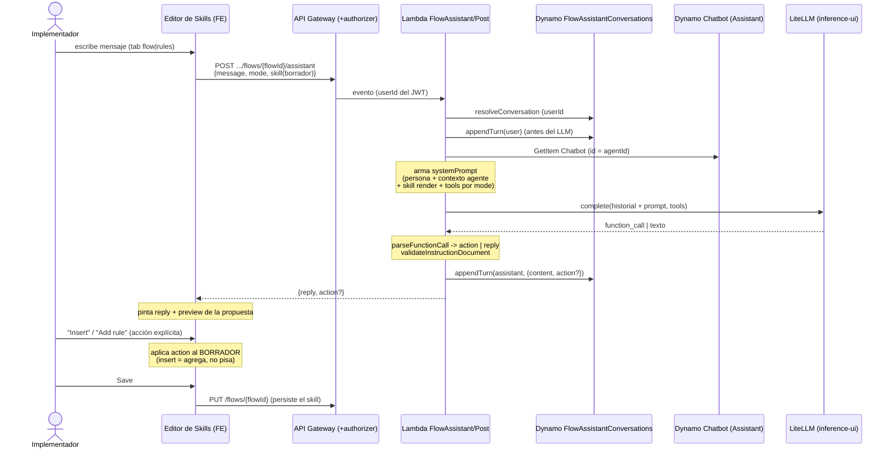
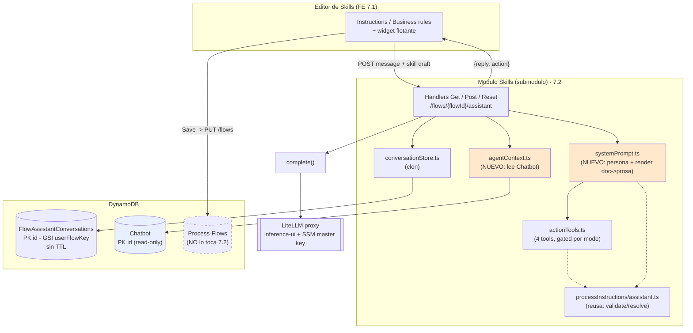

# Feature 7.2 [BE] — Servicio del Skill Assistant

> Plan de implementación / documento de diseño. **Sin código hasta aprobación.**
> Dominio: Platforma (SL) · Módulo: `Skills/` (submódulo) · PRD: *PRD - Skills*, Feature 7.
> Depende de: Feature 3.3 (contrato de instrucciones — ya existe), servicio de IA (LiteLLM — ya montado en Skills).

> ✅ **RESUELTO (evidencia en código):** `agentId` (path) === `chatbotId` === PK `id` de la tabla `Chatbot`. El router de skills se monta bajo `accounts/:accountId/assistants/:AssistantID` (comentario en `app/src/features/agent-skills/router.tsx`) y el mismo `:AssistantID` es el id del Chatbot (`ChatbotTable` PK = `id`, HASH). → El `chatbotId` del body **sobra**: el contexto del agente se deriva con `GetItem` sobre `Chatbot` usando `id = agentId` (el del path). El row de `Chatbot` además trae `accountId`, así que las lecturas opcionales de recursos (§5) encadenan gratis desde ahí.

---

## 1. Objetivo

Un servicio backend que da al implementador un **asistente conversacional persistente** dentro del editor de skills. El asistente:

- opera en dos tabs — **Instructions** (`mode: "flow"`) y **Business rules** (`mode: "rules"`) — con una sola conversación que persiste entre ambos, entre sesiones y entre días;
- conoce el **contexto completo del agente** (personalidad, reglas globales, canales, setup) + el **skill en construcción**;
- **nunca aplica cambios**: responde con **propuestas estructuradas** (`action`) que el front aplica al borrador; el usuario persiste con **Save**.

Este servicio es un clon del patrón ya en producción del **asistente de código** de custom integrations (`Skills/application/CustomIntegrations/Assistant/`), con otra persona y proponiendo `action` en vez de `artifact` de código.

---

## 2. Decisiones cerradas (confirmadas con dev — Daniel Rubiano)

| # | Decisión | Detalle |
|---|----------|---------|
| 1 | **Contexto del agente lo lee el back** | El lambda deriva `{StackName}-Chatbot`, hace `GetItem` con `id = agentId` (= chatbotId, ver banner) y arma personalidad/reglas/canales estilo Voice. El front **no** manda contexto de agente, solo el skill (borrador). No existe `flow_context` en el repo. |
| 2 | **El servicio NUNCA escribe el skill** | Propone; el front aplica al borrador; persiste con el `PUT /flows/{flowId}` existente. El único write del servicio es su tabla de conversación. |
| 3 | **`action` = parche, no diff** | Modelo del wizard (`update_personality_fields`): el payload apunta a *qué regla* / *qué párrafo*; el front lo aplica al editor. Nada de diffs ni doc regenerado. |
| 4 | **Alcance = instrucciones + reglas (Opción A)** | 4 acciones: `insert_instructions`, `edit_instructions`, `add_rule`, `edit_rule`. Crear/editar integration y MCP quedan **fuera** (ya viven en sus modales VOX-187/188, VOX-199). Cuando el proceso necesita una integración/MCP inexistente, el asistente lo **menciona en el `reply` (texto)**, NO emite `action`. Schema extensible por si luego se suman. |
| 5 | **Conversación: tope 100 turnos, sin resumen** | Igual que el code assistant. Si se llena → Restart. **Sin TTL**, solo se borra con Reset. |
| 6 | **IA: mismo proxy LiteLLM que ya usa Skills** | `inference-ui` + master key SSM `/{StackName}/ai/rta/litellm/master-key`. Nada de OpenAI directo (ese es el camino viejo del wizard). |

---

## 2.5 Diagramas

### Flujo de un turno (POST)



### Componentes y datos



> Naranja = lo único nuevo (`agentContext`, el render en `systemPrompt`). Azul = lectura read-only del agente. Punteado = `Process-Flows`, que **7.2 no escribe**.

---

## 3. Contrato de API

Base del módulo: `/skills` (authorizer cross-stack `${StackName}-auth-middleware-arn`). **Autorización idéntica a Flows:** cada lambda lleva env `CASL_PERMISSION: agent.process_flows.edit` y usa el guard `assertPermission(event, 'agent.process_flows.edit')` (`@shared/middleware/requirePermission`, ya usado por `Skills/application/Flows/guard.ts`). No introduce permiso nuevo → no crea nueva superficie CASL.

### 3.1 Endpoints

| Método | Ruta | Descripción |
|--------|------|-------------|
| `GET`  | `/skills/agents/{agentId}/flows/{flowId}/assistant` | Restaura la conversación activa (o vacía). |
| `POST` | `/skills/agents/{agentId}/flows/{flowId}/assistant` | Un turno: manda mensaje, responde con reply + `action?`. |
| `POST` | `/skills/agents/{agentId}/flows/{flowId}/assistant/reset` | Cierra la conversación activa, devuelve una nueva vacía. |

> Reset con `POST .../reset` (consistente con el code assistant), no el `DELETE` que sugería el PRD.
> Key de conversación: `${userId}#${flowId}`.

### 3.2 POST — request

```jsonc
{
  "message": "quiero que primero valide el correo del cliente",
  "mode": "flow",                 // "flow" (Instructions) | "rules" (Business rules)
  // NO se manda chatbotId: agentId (path) === chatbotId. El back lee Chatbot con id = agentId.
  "skill": {                       // borrador VIVO del editor (lo no-guardado)
    "name": "Reembolsos",
    "description": "…",
    "intent": "Solicitudes de reembolso",
    "instructions": { "schema_version": 1, "segments": [ /* … */ ] },
    "rules": [ { "id": "r1", "name": "Márgenes", "description": "…", "content": "…" } ]
  },
  "conversationId": "conv-1"        // opcional; si falta, se crea o reusa la activa
}
```

- `message` obligatorio.
- **No hay `chatbotId`** — el back usa el `agentId` del path para leer `Chatbot` (`id = agentId`).
- `skill` es el borrador actual del front (puede diferir de lo guardado en `Process-Flows`). El back lo usa tal cual para el prompt; **no lo persiste**.
- `mode` determina la persona/tab del system prompt y qué acciones puede emitir.

### 3.3 POST — response

Mismo shape que el code assistant (la propuesta viaja **dentro del turno**, para poder repintarla al reabrir):

```jsonc
{
  "conversationId": "conv-1",
  "userTurn":  { "id": "t1", "role": "user",      "content": "…", "createdAt": 1710000000000 },
  "assistantTurn": {
    "id": "t2", "role": "assistant", "content": "Te propongo agregar este paso al inicio.",
    "createdAt": 1710000005000,
    "action": {
      "type": "insert_instructions",
      "payload": { /* ver 3.4 */ }
    }
  }
}
```

- `content` = el `reply` conversacional (1-3 frases).
- `action` presente solo si el modelo propone algo aplicable; si no, turno de texto plano.

### 3.4 Tipos de `action` y payload (v1)

Unión discriminada por `type`. Todos son **parches** que el front aplica al borrador.

| `type` | `mode` | payload | Semántica |
|--------|--------|---------|-----------|
| `insert_instructions` | flow | `{ "segments": InstructionSegment[] }` | **Agrega** al final del documento (una línea en blanco de separación). Nunca pisa. |
| `edit_instructions` | flow | `{ "anchor": string, "segments": InstructionSegment[] }` | El front localiza el párrafo por el texto `anchor` y lo reemplaza por `segments`. Edición puntual, no regenera el resto. |
| `add_rule` | rules | `{ "rule": { "name": string, "description": string, "content": string } }` | Regla nueva (sin `id`; el front lo asigna). Actualiza el contador del tab. |
| `edit_rule` | rules | `{ "ruleId": string, "changes": { "name"?: string, "description"?: string, "content"?: string } }` | Modifica solo la regla referida. |

- `InstructionSegment` = el tipo ya definido en `Skills/domain/processInstructions/types.ts` (`text` \| `integration_chip` \| `mcp_chip` \| `table_op_chip`).
- **Validación:** el payload de `insert_instructions`/`edit_instructions` se pasa por **`validateInstructionDocument`** (exportado por la superficie 7.2 `processInstructions/assistant.ts`) antes de devolverlo — reusa el chequeo de `FORBIDDEN_SECRET_KEYS` y de schema; lanza `InstructionValidationError`. No re-implementar el chequeo de secretos.

> **Seam a confirmar con FE (7.1):** el locator de `edit_instructions`. Propongo `anchor` (texto a ubicar) por robustez frente a un índice de párrafo; si el editor prefiere un id/rango de segmento, se ajusta aquí. Es lo único del contrato que toca coordinar con front.

### 3.5 GET / Reset — response

**Espejar el shape ya shippeado del code assistant, verbatim** (para que el FE reuse el mismo parser). Ojo: la referencia es *inconsistente* a propósito — poblada usa `id`, vacía usa `conversationId: null`. Se replica igual, cambiando `integrationId`→`flowId` y `artifact`→`action`:

```jsonc
// Conversación existente:
{
  "id": "conv-1",
  "flowId": "flow-1",
  "status": "active",
  "createdAt": 1710000000000,
  "lastMessageAt": 1710000005000,
  "turns": [ /* turnos con `action` en vez de `artifact` */ ]
}

// Sin conversación aún (integración/skill nueva) — NO es 404:
{
  "conversationId": null,
  "flowId": "flow-1",
  "status": "active",
  "turns": []
}
```

### 3.6 Errores (heredados de `infrastructure/utils/errors.ts`)

`400` payload/params inválidos · `401` sin userId · `404` skill inexistente para ese agente (si se valida) · `409` conversación cerrada / tope de turnos alcanzado · `502` fallo del modelo (el turno del usuario ya quedó guardado) · `500`.

---

## 4. Modelo de datos

### 4.1 Nueva tabla DynamoDB

`${StackName}-FlowAssistantConversations` — espeja `CustomIntegrationConversations`.

```yaml
KeySchema:
  - { AttributeName: id, KeyType: HASH }        # uuid
AttributeDefinitions:
  - { AttributeName: id, AttributeType: S }
  - { AttributeName: userFlowKey, AttributeType: S }   # "${userId}#${flowId}"
  - { AttributeName: createdAt, AttributeType: N }
GlobalSecondaryIndexes:
  - IndexName: userFlowKey-createdAt-index
    KeySchema:
      - { AttributeName: userFlowKey, KeyType: HASH }
      - { AttributeName: createdAt, KeyType: RANGE }
    Projection: { ProjectionType: ALL }
BillingMode: PAY_PER_REQUEST
PointInTimeRecoverySpecification: { PointInTimeRecoveryEnabled: true }
SSESpecification: { SSEEnabled: true }
# SIN TTL — la conversación solo se cierra por Reset
```

> **No** reusar la tabla de custom integrations: distinta key de scope (`flowId` vs `integrationId`).

### 4.2 Modelo de dominio

`Skills/domain/models/FlowAssistantConversation.model.ts` — clon de `CustomIntegrationConversation.model.ts`, con `action` en lugar de `artifact`:

```ts
export interface FlowAssistantActionI {
  type: 'insert_instructions' | 'edit_instructions' | 'add_rule' | 'edit_rule';
  payload: Record<string, unknown>;
}

export interface FlowAssistantTurnI {
  id: string;
  role: 'user' | 'assistant';
  content: string;
  createdAt: number;               // Unix ms
  action?: FlowAssistantActionI;   // solo en turnos assistant con propuesta
}

export interface FlowAssistantConversationI {
  id?: string;
  userId?: string;
  flowId?: string;
  userFlowKey?: string;            // GSI: `${userId}#${flowId}`
  status?: 'active' | 'closed';
  createdAt?: number;
  lastMessageAt?: number;
  closedAt?: number;
  turns?: FlowAssistantTurnI[];    // embebidos
  turnCount?: number;              // denormalizado, mantenido atómicamente
  version?: number;
}

export const MAX_CONVERSATION_TURNS = 100;
export const buildUserFlowKey = (userId: string, flowId: string) => `${userId}#${flowId}`;
```

Métodos idénticos al modelo de referencia: `saveNew` (cond. `attribute_not_exists(id)`), `findActiveByUserFlow` (query GSI + filter `status=active`, newest first), `findById` (consistent read), `atomicClose` (cond. `status=active`, idempotente), `atomicAppendTurn` (cond. `status=active AND turnCount < 100`, lanza `ConversationTurnRejectedError`).

---

## 5. Contexto del agente (lo nuevo de verdad)

El único trozo sin precedente en Skills, pero con precedente directo en **Voice** (submódulo, mismo caso que Skills — lee el mismo `Chatbot`):

- `Skills/application/Flows/Assistant/services/agentContext.ts`:
  1. nombre de tabla por **env `CHATBOT_TABLE`** (convención ya usada por Voice: `process.env.CHATBOT_TABLE || 'dev-app-silia-com-Chatbot'`);
  2. **`GetItem` por PK `id = agentId`** (el del path; `ChatbotTable` PK = `id`, HASH — confirmado);
  3. arma el texto de contexto con los campos del `Chatbot`: `specialist` (rol/persona), `customPrompt`, `communicationStyle`, `businessName`, `domainTopic`, `businessRules[]` (reglas **globales**), `ethicalLimitations[]`, `fallbackResponse`, `greeting`, `channels`, `instructions` (skills del agente). El row también trae `accountId` (para §5 recursos, sin otra query). **Nota:** no hay campo literal `role`; la persona es `specialist` + `customPrompt`.

> **Reuso (auditoría 2026-09-02):** el armado del prompt del agente ya existe y es importable — **`SystemPromptBuilder` en `shared/clases/openAI/SystemPromptBuilder.class.ts`** (clase pública) + el helper `getSystemPrompt(chatbotId, timeZone?, selectedSkillId?)` que lee el Chatbot solo. `agentContext.ts` puede **reusarlo** en vez de escribir el builder a mano. ⚠️ Salvedad: `getSystemPrompt` arma el prompt **runtime completo** del agente (identidad, reglas, tools, skills, confidencialidad) — más de lo que el asistente necesita como *contexto*. Opciones: (a) usarlo tal cual como bloque "así se comporta el agente"; (b) extraer solo identidad+reglas+personalidad. Además, al estar en `shared/`, no hay problema de submódulo (Voice ya importa de `../../../Assistant/`).

Recursos conectados para el prompt (MCP / custom integrations) — **opcional**: los `InstructionSegment` ya traen `display_label`, así que el borrador del front normalmente **ya alcanza** para nombrar los chips en el prompt. Leer `Mcp-Servers` (por `agentId`) y `Custom-Integrations` (por `accountId`) es un *nice-to-have* para contexto más rico; si no aporta, se omite y se ahorra IAM. Recordar: el asistente **no** crea recursos.

---

## 6. System prompt (persona Skill Assistant)

`Skills/application/Flows/Assistant/services/systemPrompt.ts` — persona distinta al code assistant: **estructuración de procesos/skills**.

Estructura:
1. Rol: "Eres el Skill Assistant de Silia; ayudas a un implementador a redactar el proceso (instrucciones) y las reglas de negocio de una skill."
2. **Contexto del agente** (del §5): personalidad, reglas globales, canales.
3. **Contexto del skill** (del `skill` del body): nombre, intent, description, instrucciones actuales (renderizadas a texto legible con sus chips), reglas actuales, recursos conectados.
4. **Comportamiento por tab — ¿cómo sabe si hace instrucciones o reglas?**
   El asistente **no lo adivina**: lo determina el `mode` del request, que el FE manda según el **tab activo** (Instructions → `flow`, Business rules → `rules`). El `mode` hace dos cosas:
   - **fija la persona/comportamiento del prompt**, y
   - **restringe (gating) las tools ofrecidas al modelo:**
   - `mode: "flow"` → solo `insert_instructions` / `edit_instructions`. Conversación guiada: pregunta objetivo y pasos; `insert_instructions` **agrega**, nunca pisa.
   - `mode: "rules"` → solo `add_rule` / `edit_rule`. Redacta reglas (nombre + contenido).
   - **Gating estricto:** el asistente solo puede proponer el tipo del tab activo. Si detecta contenido del otro tipo (p. ej. una regla pegada estando en `flow`), lo **menciona en el `reply`** e invita a cambiar de tab — NO cruza tipos en un mismo turno (misma lógica Opción A). Como la conversación persiste entre tabs, al cambiarse el asistente ya tiene el contexto y arma la propuesta sin repetir.
5. **Reglas duras:** la IA propone, el humano aplica; jamás inventa recursos/ids; si el proceso necesita una integration/MCP que no existe, lo **menciona** (no emite acción de crearla — fuera de alcance v1); edición puntual = solo lo referido.

Emisión de la propuesta vía **function-calling** (no regex), igual que el code assistant.

**Reusar la superficie 7.2 ya existente** — `Skills/domain/processInstructions/assistant.ts` (rotulada "Assistant consumer surface (story 7.2)"). El servicio importa de ahí, no de internals:
- `validateInstructionDocument` / `InstructionValidationError` — validar lo que propone el modelo.
- `resolveInstructionDocument` + `ChipResolutionContext` — resolver el estado de los chips (active/missing/disconnected) del skill actual, para (a) meterlo al prompt y (b) evitar que el asistente proponga referencias a recursos inexistentes.
- `extractRuntimeCapabilities` — si se quiere resumir qué integraciones/tablas toca el skill.

**Falta un helper nuevo — `InstructionDocument → prosa`:** el módulo tiene serialize/deserialize (HTML↔segments), canonical, resolve y validate, pero **nada que renderice el documento a texto legible** para el prompt. Hay que escribir ese render (text verbatim + chips como `@nombre` / forma canónica de la table-op) en `systemPrompt.ts`.

---

## 7. Function-calling tools

`Skills/application/Flows/Assistant/services/actionTools.ts` — define las tools que el modelo puede llamar, **filtradas por `mode`**:

- `mode: "flow"` → `insert_instructions`, `edit_instructions`
- `mode: "rules"` → `add_rule`, `edit_rule`

Cada tool mapea 1:1 al `action.type` y su `payload` (§3.4). El parseo reusa el patrón de `parseFunctionCall.ts` (toma el primer `function_call` del `output[]`, `JSON.parse` de argumentos, fallback a texto plano con `extractOutputText`).

---

## 8. Archivos a crear / tocar

### Nuevos (en `Skills/`)
```
application/Flows/Assistant/Get/index.ts
application/Flows/Assistant/Post/index.ts
application/Flows/Assistant/Reset/index.ts
application/Flows/Assistant/services/conversationStore.ts     # clon de CustomIntegrations
application/Flows/Assistant/services/agentContext.ts          # NUEVO: read Chatbot + builder
application/Flows/Assistant/services/systemPrompt.ts          # NUEVO: persona + render InstructionDocument→prosa
application/Flows/Assistant/services/actionTools.ts           # NUEVO: 4 tools mode-gated
domain/models/FlowAssistantConversation.model.ts             # clon con `action`
domain/skills/CONTRACT.md                                     # formaliza este contrato
# Tests: espejar el layout del reference assistant, NO solo *.contract.test.ts
application/Flows/Assistant/__tests__/handlers.test.ts
application/Flows/Assistant/__tests__/conversationStore.test.ts
application/Flows/Assistant/__tests__/systemPrompt.test.ts
```

### Reusar / copiar
```
litellmCompletionAdapter.ts   # COPIAR con env SKILL_ASSISTANT_LLM_* (convención del repo: duplicar por asistente)
parseFunctionCall.ts          # copiar (idéntico)
guard.ts                      # reusar assertPermission de Flows (agent.process_flows.edit)
infrastructure/utils/errors.ts, response.ts   # ya compartidos
shared/clases/openAI/SystemPromptBuilder.class.ts + getSystemPrompt()   # reusar para agentContext (§5)
```
> **No** extraer el adapter a un `_shared/`: el codebase deliberadamente lo duplica por asistente (`TABLE_ASSISTANT_LLM_*`, `CUSTOM_INTEGRATION_LLM_*`). Seguir esa convención evita tocar el code assistant.

### Infra — `Skills/infrastructure/aws.template.yml`
- 3 lambdas nuevas (29s / 512MB / VPC, como las de integrations) + sus rutas.
- Tabla `FlowAssistantConversations` (§4.1).
- **IAM `RoleSkills`** (confirmado auditoría: hoy NO referencia `Chatbot`): agregar
  - RW sobre `FlowAssistantConversations` (tabla + índice);
  - **`dynamodb:GetItem` sobre `${StackName}-Chatbot`** ← permiso nuevo. Copiar solo el statement de Chatbot de la policy `asst-chatbot-read-policy` (`${StackName}-asst-chatbot-read-role`, Assistant template) — NO el rol entero (ese lee además Flows/Queue/Intent/CASL/KMS, no lo necesitamos);
  - **SSM del master-key ya está** en `RoleSkills` (`/${StackName}/ai/rta/litellm/master-key`) — no agregar;
  - (opcional, solo si se leen recursos §5) `Query/GetItem` sobre `Mcp-Servers` (ya lo tiene) y `Custom-Integrations` (ya lo tiene).
- **Env vars** nuevas por lambda: `FLOW_ASSISTANT_CONVERSATIONS_TABLE`, **`CHATBOT_TABLE`**, **`CASL_PERMISSION: agent.process_flows.edit`** (como todas las de Skills), + las `SKILL_ASSISTANT_LLM_*` (abajo).
- **LLM — duplicar el adapter (convención del repo):** el codebase **duplica** el `litellmCompletionAdapter` por asistente, cada uno con su prefijo de env (`TABLE_ASSISTANT_LLM_*` en Assistant, `CUSTOM_INTEGRATION_LLM_*` en Skills). → El Skill Assistant lleva su **copia** con `SKILL_ASSISTANT_LLM_BASE_URL` / `_MODEL` / `_API_KEY_SSM_PARAM` / `_TIMEOUT_MS`. Misma `base_url` (`inference-ui`) + mismo SSM master-key. Así **no se toca** el code assistant y desaparece el riesgo de coupling. (Descarta la idea previa de parametrizar el adapter.)
- `module.manifest.yaml`: no requiere imports nuevos (Chatbot se lee por nombre de tabla vía env, no por cross-stack export).

---

## 9. Flujo del POST (orden de operaciones)

Idéntico al code assistant, para no perder el mensaje del usuario ante un fallo del modelo:

1. Auth → `userId` (`getCallerContext`, bypass local).
2. Validar `message`, `mode`, params del path (`agentId`, `flowId`).
3. `resolveConversationForTurn(userId, flowId, conversationId?)`.
4. `appendTurn(user)` **antes** del LLM.
5. Cargar contexto del agente (`agentContext`) + recursos conectados.
6. Construir system prompt (§6) + tools por `mode` (§7).
7. Llamar LiteLLM (un solo round-trip).
8. `parseFunctionCall` → `action` o texto plano.
9. `appendTurn(assistant, { content, action? })` **después** del LLM.
10. Responder `{ conversationId, userTurn, assistantTurn }`.

---

## 10. Testing

- **Contract tests** (`*.contract.test.ts`, requisito del harness): shape de request/response de los 3 endpoints, los 4 `action.type` y sus payloads, tope de turnos → 409, reset cierra + abre vacía, GET vacío devuelve `turns: []` sin 404.
- Mock del adapter LiteLLM (no llamadas reales en CI).
- Validación de que el servicio **no** escribe `Process-Flows` (solo la tabla de conversación).

---

## 11. Fuera de alcance (v1)

- `create_integration` / `edit_integration` / `create_mcp` / `edit_mcp` — ya viven en sus modales (VOX-187/188, VOX-199). El asistente los **menciona en texto** (en el `reply`), no emite `action`. **⚠️ Desviación consciente del AC del ticket/PRD Feature 7**, que pide "crear o editar mediante acción estructurada": decisión de equipo (Opción A / Daniel) — el asistente no re-implementa la creación; el usuario usa el panel existente. Anotarlo al cerrar el ticket para que no se lea como incumplimiento.
- Resumen de conversaciones largas (se corta con tope + Restart).
- Escritura/persistencia del skill (la hace el `PUT /flows/{flowId}` con Save).
- **Separación automática "proceso vs reglas" a ambos destinos en un turno** — el PRD lo marca `[POR DEFINIR fase]`. En v1 el gating es estricto (un tipo por `mode`); proponer instrucción **y** regla a la vez requeriría cambiar el contrato de `action` (singular) a **`actions[]`** (plural). Queda para la fase que habilite esa separación; el resto del contrato no cambia.

---

## 12. Checklist de implementación

- [x] Copiar `litellmCompletionAdapter` (env `SKILL_ASSISTANT_LLM_*`) + `parseFunctionCall` al `services/` nuevo (convención duplicar-por-asistente). ✅
- [x] `FlowAssistantConversation.model.ts` + `conversationStore.ts`. ✅ (rama `feat/skill-assistant-7.2-service`, typecheck limpio)
- [x] `agentContext.ts` — read `Chatbot` (`id = agentId`) vía env `CHATBOT_TABLE` con `AWSDynamoService` (patrón Voice; lectura ligera + bloque propio, sin arrastrar deps de queue/flows de `SystemPromptBuilder`). ✅
- [x] Handlers Get / Post / Reset — guard `guardFlowsRequest` (role + `assertPermission('agent.process_flows.edit')`), y en Post `validateInstructionDocument` sobre el payload de instrucciones (descarta acción inválida, conserva reply). ✅
- [x] `systemPrompt.ts` — persona + per-tab + **render `InstructionDocument`→prosa** (`renderInstructionDocument`). ✅
- [x] `actionTools.ts` (4 tools mode-gated) + `toAssistantTurn` mapeo→action. ✅ (validación con `validateInstructionDocument` va en el handler — pendiente)
- [x] SAM: tabla `FlowAssistantConversations` + 3 lambdas (Get/Post/Reset) + rutas `/agents/{agentId}/flows/{flowId}/assistant[/reset]` + IAM (RW tabla nueva + `GetItem` Chatbot) + env (`FLOW_ASSISTANT_CONVERSATIONS_TABLE`, `CHATBOT_TABLE`, `SKILL_ASSISTANT_LLM_*`, `CASL_PERMISSION`). ✅ (+136 líneas aditivas; `sam validate` solo marca el `Api.SecurityPolicy` pre-existente)
- [x] `CONTRACT.md` (en `application/Flows/Assistant/CONTRACT.md` — `domain/skills/CONTRACT.md` ya existe para el SkillDocument) + tests (`handlers`/`conversationStore`/`actionTools`/`systemPrompt`, **57 casos, 4 suites, todos verdes**; adapter y agentContext mockeados, `validateInstructionDocument` real). ✅
- [x] Auditoría de consistencia de patrones vs TableAssistant + code assistant: todo consistente. Guard `guardFlowsRequest` = correcto (los 5 CRUD de Flows lo usan). Gap corregido: faltaba `conversationStore.test.ts` (clon adaptado del reference). ✅
- [ ] Confirmar con FE (7.1) el locator de `edit_instructions` (`anchor`) y el shape del body. ← única dependencia externa restante

---

## 13. Preguntas abiertas

**~~Bloqueante~~ RESUELTO:** `agentId` (path) == `chatbotId` == PK `id` de `Chatbot`. Se omite `chatbotId` del body; contexto por `GetItem id = agentId`. (Evidencia: `router.tsx` + `ChatbotTable`.)

**Menores (no bloquean el arranque):**

1. **Locator de `edit_instructions`** — `anchor` textual vs id/rango de segmento (coordinar con FE 7.1).
2. **¿Validar que el `flowId` existe en `Process-Flows`?** El body ya trae el borrador; leer la tabla sería solo para 404 estricto. Propongo no bloquear (el skill puede ser un borrador aún no guardado, como en el wizard).
3. **Modelo LLM** — mismo proxy; ¿mismo modelo que el code assistant o uno propio (por env `SKILLS_LLM_MODEL`)? Default: mismo modelo, ajustable por env.
